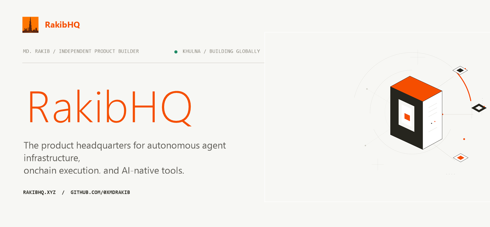
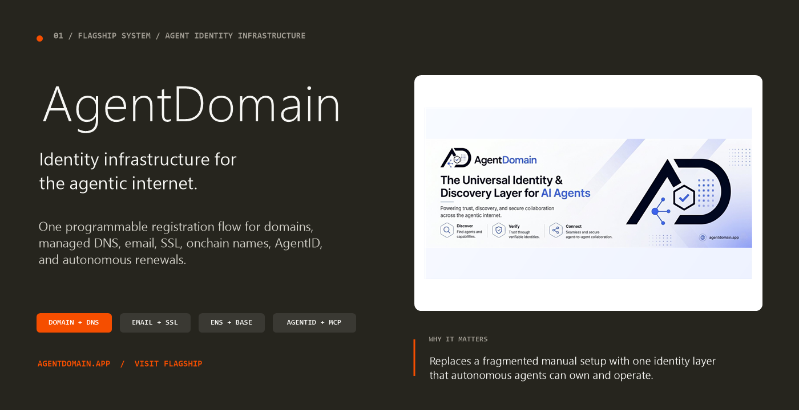
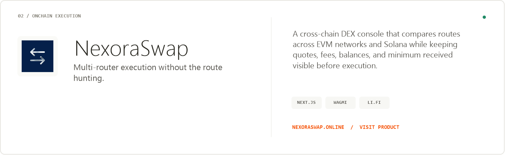
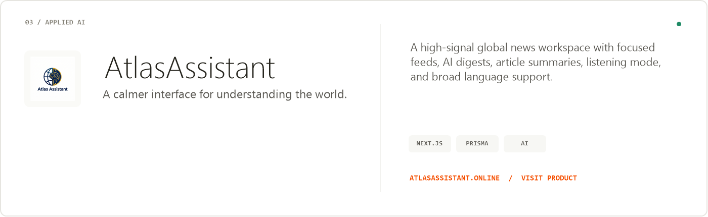
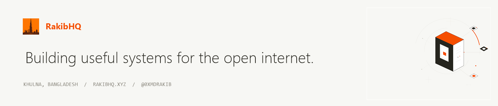

  

  <a href="https://rakibhq.xyz"><strong>Explore RakibHQ</strong></a>
  &nbsp;&nbsp;·&nbsp;&nbsp;
  <a href="https://mdrakib.xyz"><strong>Personal website</strong></a>
  &nbsp;&nbsp;·&nbsp;&nbsp;
  <a href="https://x.com/0xmdrakib"><strong>Build log</strong></a>

  I design and build complete products where
  <strong>autonomous agents</strong>, <strong>onchain infrastructure</strong>,
  and <strong>applied AI</strong> meet.
   
  RakibHQ is the public headquarters for that work.

 

  <code>BUILDER PROFILE</code>

<table>
  <tr>
    <td width="42%" valign="top">
      <h2>Md. Rakib</h2>
      
<strong>Independent product builder from Khulna, Bangladesh.</strong>

      

        I care about products that make difficult systems feel clear, complete,
        and trustworthy. My work moves from infrastructure to interface, with
        the same standard applied to both.
      

    </td>
    <td width="58%" valign="top">
      <h3>How I build</h3>
      
<code>01</code> &nbsp; Find a problem with real weight.

      
<code>02</code> &nbsp; Build the smallest complete system.

      
<code>03</code> &nbsp; Expose it to the real world early.

      
<code>04</code> &nbsp; Polish the details that earn trust.

      
<code>05</code> &nbsp; Ship, learn, and compound the work.

    </td>
  </tr>
</table>

 

  <code>01 / FLAGSHIP SYSTEM</code>

  

<table>
  <tr>
    <td width="60%" valign="top">
      <h3>One identity layer for autonomous agents.</h3>
      

        AgentDomain turns a fragmented setup process into one programmable flow:
        domain registration, managed DNS, agent email, SSL, Basename, optional ENS,
        AgentID NFT issuance, SDK and MCP access, plus autonomous renewal support.
      

    </td>
    <td width="40%" valign="top">
      
<strong>Core capabilities</strong>

      

        <code>DOMAIN + DNS</code> 
        <code>EMAIL + SSL</code> 
        <code>ENS + BASENAME</code> 
        <code>AGENTID + MCP</code>
      

    </td>
  </tr>
</table>

  <a href="https://agentdomain.app"><strong>Visit AgentDomain ↗</strong></a>
  &nbsp;&nbsp;·&nbsp;&nbsp;
  <a href="https://github.com/0xmdrakib/AgentDomain"><strong>View source ↗</strong></a>

 

  <code>Others projects</code>

  

  <a href="https://nexoraswap.online"><strong>Visit NexoraSwap ↗</strong></a>
  &nbsp;&nbsp;·&nbsp;&nbsp;
  <a href="https://github.com/0xmdrakib/NexoraSwap"><strong>View source ↗</strong></a>

 

  

  <a href="https://atlasassistant.online"><strong>Visit AtlasAssistant ↗</strong></a>
  &nbsp;&nbsp;·&nbsp;&nbsp;
  <a href="https://github.com/0xmdrakib/AtlasAssistant"><strong>View source ↗</strong></a>

 

  

  © 2026 Md. Rakib · RakibHQ is the project headquarters · The personal website remains separate at mdrakib.xyz

