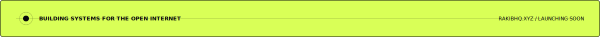
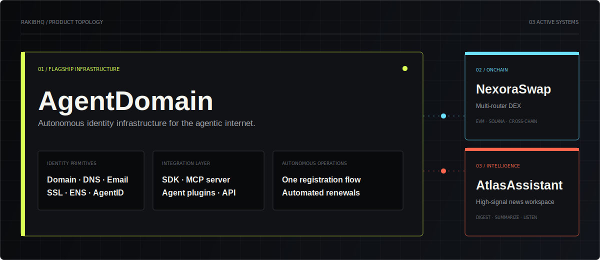

<p align="center">
  
</p>

<p align="center">
  <a href="https://github.com/0xmdrakib?tab=repositories">
    
  </a>
  <a href="https://x.com/0xmdrakib">
    
  </a>
  
</p>

<h1 align="center">Building systems for the agentic internet.</h1>

<p align="center">
  I'm <strong>Md. Rakib</strong>, an independent product builder working across
  <strong>autonomous agent infrastructure</strong>, <strong>onchain execution</strong>,
  and <strong>AI-native intelligence</strong>.
  <br>
  <strong>RakibHQ</strong> is the headquarters where those systems become one coherent body of work.
</p>

<br>



<br>

## Product topology

<p>
  Three products. Three distinct jobs. One standard: remove complexity without hiding the details that matter.
</p>



<br>

## The flagship

<table>
  <tr>
    <td width="64%" valign="top">
      <p><code>01 / AUTONOMOUS IDENTITY INFRASTRUCTURE</code></p>
      <h2><a href="https://github.com/0xmdrakib/AgentDomain">AgentDomain</a></h2>
      <h3>One registration flow. A complete identity.</h3>
      <p>
        AgentDomain gives autonomous agents a complete internet and onchain identity:
        domain, managed DNS, email, SSL, Basename, ENS, an AgentID NFT, and renewal automation.
      </p>
      <p>
        It replaces a fragmented manual setup with a programmable identity layer that agents
        can own, discover, and operate.
      </p>
      <p>
        <a href="https://agentdomain.app"><strong>Launch product ↗</strong></a>
        &nbsp;&nbsp;·&nbsp;&nbsp;
        <a href="https://github.com/0xmdrakib/AgentDomain"><strong>Inspect source ↗</strong></a>
      </p>
    </td>
    <td width="36%" valign="top">
      <p><code>IDENTITY BUNDLE</code></p>
      <p>✓ Traditional domain + managed DNS</p>
      <p>✓ Agent inbox + send API</p>
      <p>✓ Apex SSL provisioning</p>
      <p>✓ Basename + optional ENS</p>
      <p>✓ AgentID identity record</p>
      <p>✓ SDK, MCP server, and plugins</p>
      <p>✓ Autonomous renewal workflow</p>
    </td>
  </tr>
</table>

<p>
  
  
  
  
  
  
</p>

<br>

## Selected systems

<table>
  <tr>
    <td width="50%" valign="top">
      
      <p><code>02 / ONCHAIN EXECUTION</code></p>
      <h2><a href="https://github.com/0xmdrakib/NexoraSwap">NexoraSwap</a></h2>
      <h3>Multi-router execution without the route hunting.</h3>
      <p>
        A cross-chain DEX console that compares and executes routes across EVM networks
        and Solana through 1inch, LI.FI, and gas.zip.
      </p>
      <p>
        Quotes, fees, wallet balances, route choices, and minimum received stay visible
        before execution.
      </p>
      <p>
        <a href="https://nexoraswap.online"><strong>Open product ↗</strong></a>
        &nbsp;·&nbsp;
        <a href="https://github.com/0xmdrakib/NexoraSwap"><strong>Source ↗</strong></a>
      </p>
    </td>
    <td width="50%" valign="top">
      
      <p><code>03 / AI INTELLIGENCE</code></p>
      <h2><a href="https://github.com/0xmdrakib/AtlasAssistant">AtlasAssistant</a></h2>
      <h3>A calmer interface for understanding the world.</h3>
      <p>
        A high-signal global news workspace with focused feeds, useful filters,
        AI digests, article summaries, listening mode, and broad language support.
      </p>
      <p>
        The product turns a noisy news cycle into a structured reading flow centered
        on context, signal, and time saved.
      </p>
      <p>
        <a href="https://atlasassistant.online"><strong>Open product ↗</strong></a>
        &nbsp;·&nbsp;
        <a href="https://github.com/0xmdrakib/AtlasAssistant"><strong>Source ↗</strong></a>
      </p>
    </td>
  </tr>
</table>

<br>

## Operating system

```text
01  Find a problem with real weight.
02  Build the smallest complete system.
03  Expose it to the real world early.
04  Polish the details that earn trust.
05  Ship, learn, and compound the work.
```

<table>
  <tr>
    <td align="center" width="33%">
      <strong>AGENT INFRASTRUCTURE</strong><br>
      <sub>Identity, ownership, discovery, automation</sub>
    </td>
    <td align="center" width="33%">
      <strong>ONCHAIN PRODUCTS</strong><br>
      <sub>Execution, liquidity, transparent routing</sub>
    </td>
    <td align="center" width="33%">
      <strong>AI-NATIVE TOOLS</strong><br>
      <sub>Signal, context, focused intelligence</sub>
    </td>
  </tr>
</table>

<br>

## RakibHQ online

The full project registry, detailed product pages, and future work will live at
**`rakibhq.xyz`**. The website is built and currently moving through the launch sequence.

```text
RAKIBHQ.XYZ
STATUS   /  LAUNCH PREPARATION
SYSTEMS  /  03 ACTIVE
BUILDER  /  MD. RAKIB
```

<p align="center">
  <sub>Built from Dhaka for the open internet.</sub>
</p>
