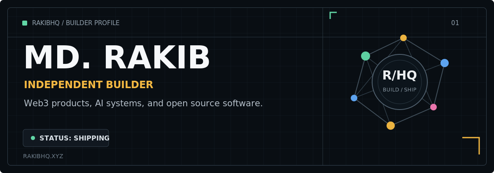

<p align="center">
  
</p>

<p align="center">
  
  <a href="https://x.com/0xmdrakib"></a>
  <a href="https://github.com/0xmdrakib?tab=repositories"></a>
</p>

## Building useful systems for the open internet

I'm **Md. Rakib**, an independent builder working where **autonomous agents, onchain infrastructure, and product engineering** meet. I turn ambitious ideas into usable products, then keep refining them until they feel simple.

**RakibHQ** is the home for my projects, experiments, and long-term work.

### Current focus

- Building **[AgentDomain](https://github.com/0xmdrakib/AgentDomain)**, an autonomous identity stack for AI agents.
- Shipping **[XphereSwap](https://github.com/0xmdrakib/XphereSwap)** across swaps, liquidity, and bridging.
- Bringing every project into one coherent ecosystem at **`rakibhq.xyz`**.

## Selected work

| Project | What it does | Core stack | Links |
| --- | --- | --- | --- |
| **AgentDomain** | Identity, naming, and service infrastructure for autonomous agents. | TypeScript, Turborepo | [Source](https://github.com/0xmdrakib/AgentDomain) / [Live](https://agentdomain.app) |
| **XphereSwap** | A DEX for swaps, liquidity, and cross-chain bridging on Xphere. | TypeScript, Solidity, pnpm | [Source](https://github.com/0xmdrakib/XphereSwap) |
| **AXON Protocol** | Policy-controlled USDC payment vaults for autonomous AI agents. | React, viem, Hardhat | [Source](https://github.com/0xmdrakib/AXONProtocol) / [Live](https://axonprotocol.xyz) |
| **Atlas Assistant** | A unified news workspace with AI-powered summaries. | Next.js, Prisma, TypeScript | [Source](https://github.com/0xmdrakib/AtlasAssistant) |
| **BaseGuardian** | Wallet health and security analysis for the Base ecosystem. | Next.js, Ethers, Moralis | [Source](https://github.com/0xmdrakib/BaseGuardian) / [Live](https://baseguardian.vercel.app) |
| **2048TX** | The classic 2048 game with onchain and Farcaster integrations. | Next.js, Base, Farcaster | [Source](https://github.com/0xmdrakib/2048TX) / [Live](https://2048tx.vercel.app) |

<p align="center">
  <a href="https://github.com/0xmdrakib?tab=repositories"><strong>Explore all projects</strong></a>
</p>

## Tools I build with

<p>
  
  
  
  
  
  
  
  
  
</p>

## How I work

```text
01  Find a real problem.
02  Build the smallest complete solution.
03  Test it in the real world.
04  Polish the details that earn trust.
05  Ship, learn, and improve.
```

<p align="center">
  <sub>Building in public from RakibHQ.</sub>
</p>
