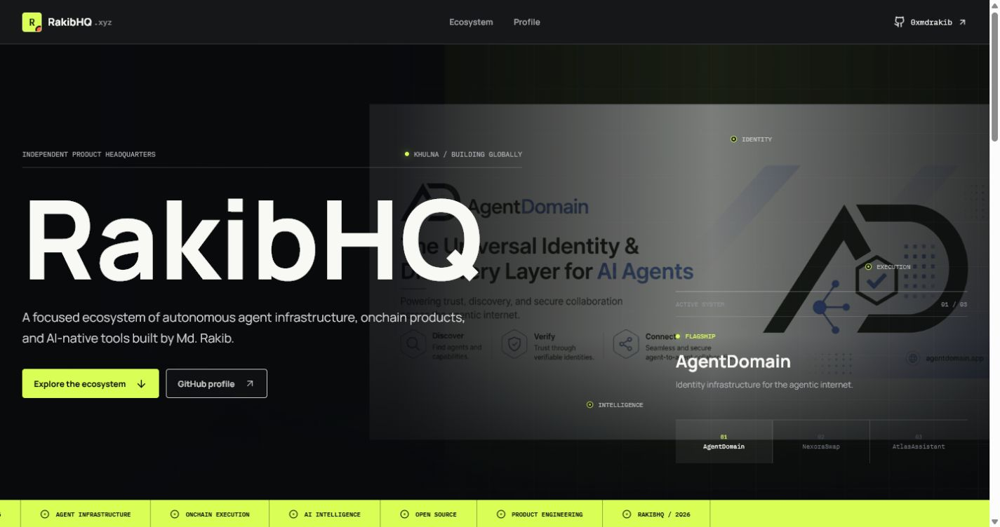
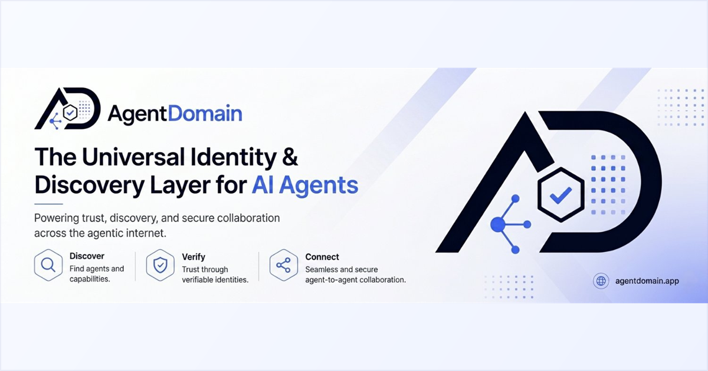

  

  

  
  
  

<code>MD. RAKIB / INDEPENDENT PRODUCT BUILDER / KHULNA</code>

<h1 align="center">Building useful systems for the open internet.</h1>

  I work where <strong>autonomous agents</strong>, <strong>onchain infrastructure</strong>,
  and <strong>thoughtful product engineering</strong> meet.
   
  RakibHQ is the public home for that work and the ecosystem it is becoming.

 

## Flagship system

<table>
  <tr>
    <td width="62%" valign="top">
      
<code>01 / AGENT IDENTITY INFRASTRUCTURE</code>

      <h2><a href="https://github.com/0xmdrakib/AgentDomain">AgentDomain</a></h2>
      <h3>A complete internet and onchain identity, in one registration flow.</h3>
      

        AgentDomain gives autonomous agents the infrastructure required to exist,
        communicate, transact, and remain operational: a domain, managed DNS,
        email, SSL, Basename, optional ENS, an AgentID NFT, and renewal automation.
      

      

        Instead of asking builders to assemble disconnected services manually,
        it turns identity into one programmable layer that agents can own and use.
      

      

        <a href="https://agentdomain.app"><strong>Visit AgentDomain</strong></a>
        &nbsp;&nbsp;·&nbsp;&nbsp;
        <a href="https://github.com/0xmdrakib/AgentDomain"><strong>View source</strong></a>
      

    </td>
    <td width="38%" valign="top">
      
       
      <code>DOMAIN · DNS · EMAIL · SSL · BASENAME · ENS · AGENTID · MCP</code>
    </td>
  </tr>
</table>

  
  
  
  
  
  

 

## Selected products

<table>
  <tr>
    <td width="50%" valign="top">
      
      
<code>02 / ONCHAIN EXECUTION</code>

      <h2><a href="https://github.com/0xmdrakib/NexoraSwap">NexoraSwap</a></h2>
      <h3>Multi-router execution without the route hunting.</h3>
      

        A cross-chain DEX console for comparing and executing routes across EVM
        networks and Solana through 1inch, LI.FI, and gas.zip.
      

      

        Quotes, fees, balances, route choices, and minimum received remain visible
        before a transaction is executed.
      

      

        <a href="https://nexoraswap.online"><strong>Visit product</strong></a>
        &nbsp;·&nbsp;
        <a href="https://github.com/0xmdrakib/NexoraSwap"><strong>View source</strong></a>
      

      <code>NEXT.JS · WAGMI · VIEM · LI.FI · SOLANA</code>
    </td>
    <td width="50%" valign="top">
      
      
<code>03 / APPLIED AI</code>

      <h2><a href="https://github.com/0xmdrakib/AtlasAssistant">AtlasAssistant</a></h2>
      <h3>A calmer interface for understanding the world.</h3>
      

        A high-signal global news workspace with focused feeds, useful filters,
        AI digests, article summaries, listening mode, and broad language support.
      

      

        It turns a noisy news cycle into a structured reading flow centered on
        context, signal, and time saved.
      

      

        <a href="https://atlasassistant.online"><strong>Visit product</strong></a>
        &nbsp;·&nbsp;
        <a href="https://github.com/0xmdrakib/AtlasAssistant"><strong>View source</strong></a>
      

      <code>NEXT.JS · TYPESCRIPT · PRISMA · AI · RSS</code>
    </td>
  </tr>
</table>

 

## How I build

<table>
  <tr>
    <td width="33%" valign="top">
      <strong>01 · FIND THE WEIGHT</strong>
        
      Start with a problem that is real enough to deserve a complete product.
    </td>
    <td width="33%" valign="top">
      <strong>02 · SHIP THE SYSTEM</strong>
        
      Build the smallest coherent version, expose it early, and learn from reality.
    </td>
    <td width="33%" valign="top">
      <strong>03 · EARN THE TRUST</strong>
        
      Polish the details, document the work, and keep compounding what proves useful.
    </td>
  </tr>
</table>

 

## Headquarters

<table>
  <tr>
    <td width="65%" valign="top">
      <h3>RakibHQ is the growing registry for everything I build.</h3>
      

        The website is structured to hold many more products over time while keeping
        every project easy to search, understand, visit, and inspect.
      

    </td>
    <td width="35%" valign="top">
      <code>LOCATION  / KHULNA</code> 
      <code>BUILDER   / MD. RAKIB</code> 
      <code>GITHUB    / @0XMDRAKIB</code> 
      <code>HQ        / RAKIBHQ.XYZ</code>
    </td>
  </tr>
</table>

  Designed and built by Md. Rakib · Khulna, Bangladesh

